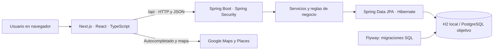

# Presentación de FurgonApp

## Arranque y cuentas

Desde la raíz del repositorio, con Java 17 y Node.js 20.9 o superior:

```powershell
.\start.ps1 -Presentation
# En siguientes arranques, si no cambió el código:
.\start.ps1 -Presentation -SkipBuild
```

Abre http://127.0.0.1:3000. El primer comando instala dependencias y compila. Se necesita Internet para esa preparación y para Google Maps. Los puertos 3000 y 8080 deben estar libres.

| Rol | Correo | Contraseña |
| --- | --- | --- |
| Administrador | administrador@presentacion.local | administrador |
| Apoderado | apoderadoprofe@presentacion.local | apoderadoprofe |
| Furgonista | furgonistaprofe@presentacion.local | furgonistaprofe |
| Colegio | colegioprueba@presentacion.local | colegioprueba |

Las contraseñas coinciden con el texto anterior a `@` y cumplen el mínimo de 12 caracteres del registro. Son credenciales públicas de demostración: no deben utilizarse en una instalación expuesta a Internet ni para información real. Los correos son ficticios; no reciben mensajes.

El interruptor `-Presentation` habilita `app.presentation.enabled` únicamente en el perfil `local` y desactiva el bootstrap ordinario durante ese arranque. Crea las cuatro cuentas, además de las cuentas locales que ya existan. No reemplaza contraseñas ni borra datos. En arranques posteriores conserva el avance; si solo existe parte del conjunto, detiene la carga para evitar sobrescribir cuentas.

La información queda en `backend/data/furgonapp-accounts.mv.db`: persiste al cerrar o reiniciar el programa. Git excluye esa base. El repositorio incluye el **código para generar los datos**, no una copia de la base del computador. Una instalación nueva puede recrear el escenario usando el mismo comando.

## Qué queda preparado

- Colegio Los Aromos · Presentación: institución ficticia en Macul, datos de contacto, descripción, colores y logo.
- Carlos Presentación: perfil aprobado, fotografía ilustrativa y Hyundai H1 de 16 pasajeros, patente de ejemplo PRBA-10.
- Cinco documentos de ejemplo aprobados y descargables, explícitamente marcados sin validez oficial. No representan licencias ni certificados auténticos.
- Cobertura en Macul, Ñuñoa, La Florida y Peñalolén; furgonista asociado al colegio.
- Apoderado con sus datos y el colegio guardado.
- Dieciséis cupos disponibles inicialmente. No se insertan cotizaciones ni contratos previos: se crean durante la demostración.

## Guion para mostrar el flujo

1. Entra como **apoderado**, abre Colegio Los Aromos y busca `Avenida Macul`. Selecciona una sugerencia de Google, no solo texto escrito. Busca furgonistas y solicita cotización a Carlos Presentación.
2. Cierra sesión y entra como **furgonista**. Abre Cotizaciones y envía una oferta de **$78.000**. La referencia simulada es $75.000; con el margen predeterminado del 25 %, el máximo es $93.750.
3. Vuelve al **apoderado**, acepta la oferta y confirma. Muestra el contrato activo y las notificaciones. No se realiza un pago.
4. Entra como **furgonista** para ver el contrato y el cambio de 16 a 15 cupos disponibles.
5. Entra como **colegio** para mostrar identidad institucional y transportistas asociados. No tiene acceso a las cotizaciones ni contratos privados de las familias.
6. Entra como **administrador** para mostrar usuarios, documentos, cotizaciones, contratos y cupos.

Puedes usar pestañas con sesiones distintas, porque la sesión se guarda por pestaña, o cerrar sesión entre roles. Si el navegador duplica una pestaña ya autenticada, cierra esa sesión antes de entrar con otro rol.

No edites identidad, vehículo, fotografías o documentos del conductor justo antes de cotizar: esos cambios invalidan la aprobación y requieren revisión administrativa. Cada aceptación consume otro cupo; reiniciar no deshace el ensayo. No borres la base para repetirlo, porque también contiene tus otras cuentas.

Para Google Maps configura `GOOGLE_MAPS_BROWSER_KEY` en `frontend/.env.local` según [GOOGLE_MAPS.md](GOOGLE_MAPS.md). La clave no se distribuye en Git. Si clonas en otro computador, debes configurarla allí y reiniciar/recompilar el frontend cuando corresponda. La búsqueda requiere conexión a Google.

## Cómo explicar la arquitectura

Puedes presentarlo así:

> FurgonApp es una aplicación web de transporte escolar con cuatro roles. Separé la interfaz del servidor: Next.js con React y TypeScript para la experiencia del usuario, y Spring Boot con Java para autenticación y reglas de negocio. El backend es un monolito modular con API REST, persistencia relacional y transacciones para reservar cupos sin sobreventa.



Next.js reenvía `/api/*` a Spring; no hay dos implementaciones de las reglas del negocio. El navegador muestra el estado, pero el servidor decide permisos, precios aceptables, aprobación y disponibilidad. Localmente Next escucha en 3000 y Spring en 8080.

**Monolito modular** significa que el backend se ejecuta como una aplicación, organizada en módulos de dominio: autenticación, usuarios, furgonistas, vehículos, instituciones, cobertura, documentos, cotizaciones, contratos y notificaciones. Comparten una base y pueden ejecutar una operación completa en una transacción. No son microservicios.

El recorrido de una petición es **controlador → servicio → repositorio → base de datos**. El controlador recibe y valida HTTP; el servicio aplica las reglas; el repositorio realiza la persistencia mediante JPA. Los DTOs definen qué datos recibe la interfaz y evitan exponer contraseñas o documentos privados.

## Herramientas y para qué se usan

| Tecnología | Función en este proyecto |
| --- | --- |
| Java 17 y Spring Boot 3.5.16 | Servidor y reglas de negocio |
| Spring Web / REST | Endpoints HTTP con JSON |
| Spring Security, JWT y BCrypt | Autenticación, permisos y hash de contraseñas |
| Jakarta Validation | Validación de formularios también en el servidor |
| Spring Data JPA / Hibernate | Repositorios, entidades y transacciones |
| H2 | Base local persistente; base en memoria aislada para pruebas |
| PostgreSQL | Motor configurado para despliegue; no es el motor del arranque local |
| Flyway | Migraciones versionadas del esquema SQL |
| Next.js 16, React 19 y TypeScript | Rutas, componentes, formularios y tipado del frontend |
| CSS, Tailwind CSS 4 y Lucide React | Estilos, herramientas de estilos e iconos |
| Google Maps JavaScript API / Places New | Mapa y autocompletado real de direcciones |
| Maven, Node.js y npm | Compilación y dependencias |
| JUnit, Spring Boot Test y MockMvc | Pruebas de integración del backend |
| Playwright y node:test | Pruebas del navegador y de la API HTTP |
| Docker Compose | Configuración alternativa de servicios y PostgreSQL |
| Git / GitHub | Historial de cambios y repositorio compartido |

## Modelo de datos

`User` contiene identidad, rol, estado activo y hash de contraseña. Un furgonista tiene `DriverProfile` y, en esta versión, un vehículo. `Institution` tiene un propietario colegio. Las tablas `DriverInstitution` y `GuardianInstitution` relacionan instituciones con conductores y apoderados. `CoverageArea` define las comunas atendidas.

`Quote` guarda la solicitud, dirección, comuna, precio sugerido, oferta y estado. `Contract` nace al aceptar una oferta y reserva un asiento. `DriverDocument` guarda archivos privados y su revisión; `MediaAsset` separa fotos y logos públicos. `Notification` almacena avisos internos. Se utilizan identificadores UUID, fechas de creación/actualización y restricciones SQL.

## Seguridad y consistencia

- La contraseña se guarda como hash BCrypt, no como texto legible. El login emite un JWT firmado, válido por ocho horas. El frontend lo conserva en `sessionStorage`.
- Los permisos se comprueban en Spring y en los servicios, incluyendo propiedad de cada recurso. Ocultar un botón no constituye la protección.
- El registro público permite apoderado, furgonista y colegio; no administrador.
- Una cuenta desactivada no puede operar aunque conserve un token anterior.
- Los archivos privados requieren autenticación y autorización. Las fotos y logos públicos se gestionan por separado.
- Los cupos disponibles se calculan: **capacidad menos contratos activos**. No hay un segundo contador que pueda quedar desactualizado.
- Al aceptar, una transacción bloquea cotización, perfil y vehículo; vuelve a validar condiciones y capacidad; crea el contrato, actualiza la cotización y genera avisos. Una restricción única impide dos contratos para la misma cotización.
- El aislamiento mediante bloqueos pesimistas evita que dos reservas simultáneas consuman el mismo último asiento. Si algo falla, se revierte la operación completa.

## Qué funciona y qué no debes prometer

Funcionan el registro y login, los permisos, los perfiles, la configuración del colegio, documentos y revisión manual, Google Maps, filtros por cobertura y cupos, cotizaciones, ofertas, contratos y avisos internos.

El precio de referencia es **simulado**, no calculado por kilómetros reales. Google obtiene la dirección; el filtro de cobertura usa la **comuna**, no rutas ni polígonos geográficos. El backend no certifica el domicilio ni vuelve a consultar Google. Los contratos son registros de la aplicación; **no hay cobro ni firma electrónica integrada**.

No están implementados pagos, GPS en vivo, correo/WhatsApp/push, recuperación/cambio de contraseña, verificación de correo o MFA. La revisión documental no consulta registros del gobierno. PostgreSQL es el objetivo de despliegue, pero las comprobaciones locales con H2 no sustituyen una validación real sobre PostgreSQL.

## Preguntas típicas del profesor

**¿Por qué separar frontend y backend?** Para que la interfaz evolucione sin duplicar reglas y para que los permisos y operaciones críticas se resuelvan en el servidor.

**¿Por qué un monolito modular?** Es suficiente para esta escala y simplifica despliegue y transacciones, manteniendo separación por dominio. Microservicios agregarían complejidad innecesaria ahora.

**¿Qué pasa si dos familias aceptan el último cupo?** El bloqueo del vehículo serializa la reserva; la segunda operación vuelve a consultar ocupación y no puede sobrepasar la capacidad.

**¿Dónde están los datos?** En H2 persistente durante la demostración local. El perfil de pruebas usa memoria y es independiente. La aplicación también tiene configuración para PostgreSQL.

**¿GitHub almacena los usuarios?** No almacena la base local. Sí contiene el inicializador opcional y las credenciales ficticias para reproducir esta presentación.

**¿Qué mejorarías?** Recuperación de acceso y correo verificado, pagos reales, cálculo de rutas/precios, almacenamiento externo de archivos, paginación, auditoría, monitoreo, respaldos y pruebas del despliegue sobre PostgreSQL.

Para profundizar: [ARCHITECTURE.md](ARCHITECTURE.md), [API.md](API.md) y [GOOGLE_MAPS.md](GOOGLE_MAPS.md).
